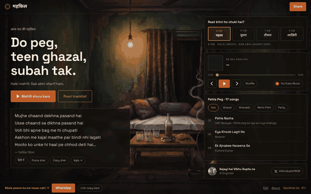
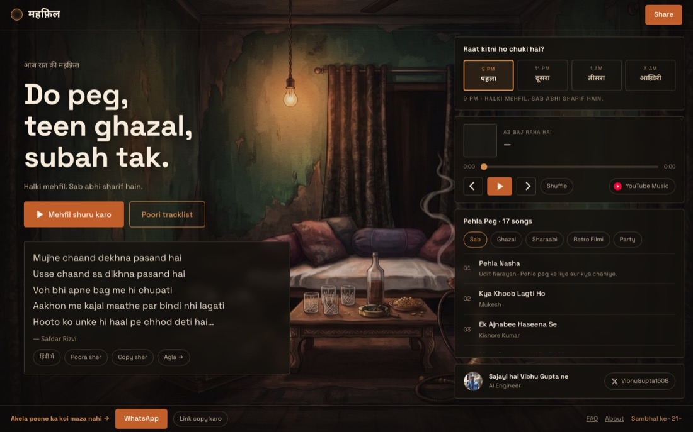
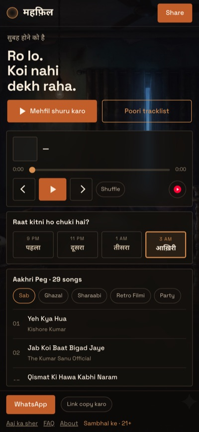
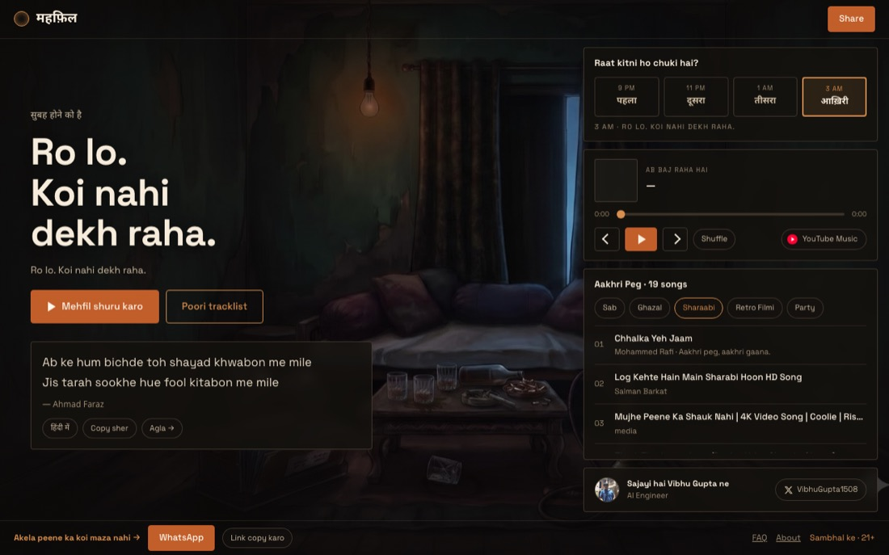

<div align="center">

# महफ़िल · Mehfil

**Do peg, teen ghazal, subah tak.**

A playlist site for the kind of evening where nobody is dancing.
One room, one night, four pegs — and the room gets darker as the night goes on.

[](https://raatkimehfil.xyz)




</div>

---

## The idea

Most playlist sites give you a list. This one gives you a **night**.

The site reads your clock and drops you into the hour you're actually in. Pick a
different peg and the room cross-fades with it — same camera, same furniture,
a little further gone.

| | | the room | the mood |
|---|---|---|---|
| **पहला पेग** | 9 PM | glasses full, hookah just lit | *Sab abhi sharif hain* |
| **दूसरा पेग** | 11 PM | one glass tipped over, coals glowing | *Ab shayari shuru* |
| **तीसरा पेग** | 1 AM | smoke in layers, a shawl on the bolster | *Purani baatein nikal aayi* |
| **आख़िरी पेग** | 3 AM | bulb failing, bottle empty, dawn at the curtain | *Ro lo, koi nahi dekh raha* |

Each peg has its own playlist, its own shayari, and its own URL.

## What's in it

- **145 songs** — ghazal, sharaabi, purane filmi, and a party tab kept deliberately separate
- **13 shayari** in Devanagari *and* Hinglish, with a toggle that remembers your choice
- **Never scrolls.** The whole thing is one viewport at every size, 360×640 up to 1920×1080. Only the tracklist scrolls, inside its own panel.
- **Music keeps playing** when you browse to another peg — a green dot shows where it's coming from
- **Auto-advance** to the next song, skipping anything YouTube refuses to play
- **Live counter** — *"12 mehfilein chal rahi hain"*
- No login, no ads, no autoplay-on-load

<table>
<tr>
<td width="62%"></td>
<td></td>
</tr>
<tr>
<td align="center"><sub>Desktop — copy on the left, controls right, room visible between</sub></td>
<td align="center"><sub>390×844</sub></td>
</tr>
</table>


<sub>Every category is its own crawlable page</sub>

## How it works

No framework, no bundler, no build step for development — open it and it runs.

```
index.html          the whole page
css/styles.css      layout, scrim, breakpoints
js/data.js          ← everything you'd want to edit lives here
js/app.js           peg switching, player, tracklist, share
build.mjs           generates a static page per peg and per category
worker/             Cloudflare Worker: live listeners + playlist sync
```

**Audio** plays through a hidden YouTube IFrame player on `youtube-nocookie.com`,
lazy-loaded on the first tap. Nothing is hosted here, so the play counts land
where they should — with the artist.

**The rooms** are four AI-generated stills of one room, edited from a single
master so the camera never moves. Prompts and method are in
[`docs/VIDEO-PROMPTS.md`](docs/VIDEO-PROMPTS.md); video versions are drafted but
the site ships stills for now.

**SEO** — `build.mjs` emits nine real pages with the tracklist already in the
HTML, plus `sitemap.xml`, `robots.txt` and `MusicPlaylist` structured data.
Before that, a crawler saw 85 words and zero song titles.

## Running it

```bash
python3 -m http.server 4173     # any static server will do
open http://localhost:4173
```

To generate the static pages the way production does:

```bash
node build.mjs
```

Adding a song is one line in `js/data.js`:

```js
{ title: 'Ranjish Hi Sahi', artist: 'Mehdi Hassan', year: '1977',
  yt: 'XXXXXXXXXXX', tags: ['ghazal'], note: 'Why this one sits at 1 AM.' }
```

`yt` is the id after `?v=` in a YouTube URL. Check it's embeddable first —
open `youtube.com/embed/<id>`; if that refuses, so will the site.

Optional: deploy `worker/` for the live listener count and automatic playlist
sync — see [`worker/README.md`](worker/README.md). The site works fine without it.

## Shayari

Ghalib, Mir Taqi Mir and Momin Khan Momin are public domain. The rest are
credited to their poets — **Ahmad Faraz**, **Parveen Shakir**, **Safdar Rizvi**,
**Zia Mazkoor** — and four pieces remain unattributed, marked as such in
`js/data.js`. If one of them is yours, open an issue and I'll put your name on it.

## A note

This is about old-school mehfils — a takht, a harmonium, one bulb, and
conversation that runs past the songs. Not clubs, not bottle service.

*Peeyo, magar sambhal ke. Gaadi mat chalana.* 21+

---

<div align="center">
<sub>Built by <a href="https://x.com/VibhuGupta1508">Vibhu Gupta</a> · AI Engineer</sub>
</div>
